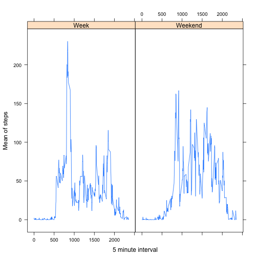

Programming Assignment 1
============================================

##Question 1:

In this parte we are going to load the data and also, the libraries that we are going to need.
Finally, we format the "date" column with date format, and extract the "NA"'s in the data.

```r
data <- read.csv("activity.csv")
data$date <- as.Date(data$date)
library(plyr)
library(dplyr)
```

```
## 
## Attaching package: 'dplyr'
## 
## The following objects are masked from 'package:plyr':
## 
##     arrange, count, desc, failwith, id, mutate, rename, summarise,
##     summarize
## 
## The following object is masked from 'package:stats':
## 
##     filter
## 
## The following objects are masked from 'package:base':
## 
##     intersect, setdiff, setequal, union
```

```r
final_data <- filter(data,steps!="NA")
head(final_data)
```

```
##   steps       date interval
## 1     0 2012-10-02        0
## 2     0 2012-10-02        5
## 3     0 2012-10-02       10
## 4     0 2012-10-02       15
## 5     0 2012-10-02       20
## 6     0 2012-10-02       25
```

##Question 2

Now, we are goint to use the information to determine the number of total steps per day.


```r
resumen <- summarise(group_by(final_data,date),total=sum(steps))
mean_steps <- round(mean(as.numeric(unlist(resumen[,2]))),2)
median_steps <- round(median(as.numeric(unlist(resumen[,2]))),2)
with(resumen,plot(date,total,type="h",main="Total steps by date",
                  xlab="Date",
                  ylab="Number of steps"))
```

 

Finally, using the mean and median R functions, we determine this results:

- Mean of total steps: 1.076619 &times; 10<sup>4</sup>
- Median of total steps: 1.0765 &times; 10<sup>4</sup>

##Question 3

Now we're going to use the information in the "final_data" archive to determine the average daily activity pattern.


```r
five_minute_interval <- summarise(group_by(final_data,interval),total=mean(steps))
with(five_minute_interval,plot(interval,total,type="l",main="Average Daily Pattern",
                               xlab="5 Minute Interval",
                               ylab="Average number of steps"))
```

 

```r
maximo <- max(five_minute_interval$total)
maximo <- as.integer(filter(five_minute_interval,total==maximo)[1,1])
```

As we can see in this graph, the maximum number of steps was recorded in the 835 th. interval in the graphic.

##Question 4

Let's now calculate the total number of missing values in the given dataset:


```r
total <- nrow(data[is.na(data$steps),])
print(total)
```

```
## [1] 2304
```

Now let's proceed to input the mean for each of the missing values in the data.

```r
resumen <- summarise(group_by(final_data,interval),mean_steps=mean(steps))
for(i in 1:nrow(data)){
    if(is.na(data[i,1])){
        intervalo <- data[i,3]
        data[i,1] <- filter(resumen,interval==intervalo)[1,2]
    }
}
head(data)
```

```
##       steps       date interval
## 1 1.7169811 2012-10-01        0
## 2 0.3396226 2012-10-01        5
## 3 0.1320755 2012-10-01       10
## 4 0.1509434 2012-10-01       15
## 5 0.0754717 2012-10-01       20
## 6 2.0943396 2012-10-01       25
```

Now that we have the full dataset, let's create a histogram of the total number of steps per day.


```r
resumen <- summarise(group_by(data,date),total=sum(steps))
mean_steps_complete <- round(mean(as.numeric(unlist(resumen[,2]))),2)
median_steps_complete <- round(median(as.numeric(unlist(resumen[,2]))),2)
with(resumen,plot(date,total,type="h",main="Total number of steps per day",
                  xlab="Date",
                  ylab="Number of steps"))
```

 

Let's remember that in the last exercise we determine that the mean was 1.076619 &times; 10<sup>4</sup> and the median was 1.0765 &times; 10<sup>4</sup>. In this new exercise, using the full dataset we have determined that the new mean is 1.076619 &times; 10<sup>4</sup> while the median of the same example is 1.076619 &times; 10<sup>4</sup>.

##Question 5

In this exercise let's now create a vector in the dataset using the information about weekdays and weekends from the "date" column.


```r
data <- mutate(data,day=weekdays(data$date,abbreviate=TRUE),weekday=0)
dias <- c("Mon","Tue","Wed","Thu","Fri")
for(i in 1:nrow(data)){
    if (sum(dias==data[i,4])!=0){
        data[i,5] <- "Week"
    }else{
        data[i,5] <- "Weekend"
    }
}
data <- data[,c(1,2,3,5)]
head(data)
```

```
##       steps       date interval weekday
## 1 1.7169811 2012-10-01        0    Week
## 2 0.3396226 2012-10-01        5    Week
## 3 0.1320755 2012-10-01       10    Week
## 4 0.1509434 2012-10-01       15    Week
## 5 0.0754717 2012-10-01       20    Week
## 6 2.0943396 2012-10-01       25    Week
```

Now that we have the information about weekdays and weekends, let's proceed with a graphic.


```r
library(lattice)
data <- transform(data,weekday=factor(weekday))
resumen <- summarise(group_by(data,weekday,interval),mean_steps=mean(steps))
resumen <- transform(resumen,weekday=factor(weekday))
xyplot(mean_steps~interval|weekday,data=resumen,type="l",
       xlab="5 minute interval",
       ylab="Mean of steps")
```

 

As we can see in this plot, there's a difference between weekdays and weekend number of steps recorded in our dataset. The weekdays information tends to increase a lot in the firsts five minute intervals, while the weekends activity tends to be close to a mean (appears to be more homogeneus).

